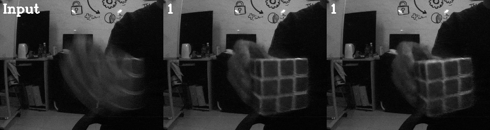

# EVDI - Unifying Motion Deblurring and Frame Interpolation with Events (Academic Use Only)
## [Paper](https://arxiv.org/abs/2203.12178) | [Supp](https://drive.google.com/file/d/11r66OHe7ETm6WC91W_av22T9i4ziiFHJ/view?usp=sharing) | [Video](https://www.youtube.com/watch?v=ih7o5PawSCw)

Slow shutter speed and long exposure time of frame-based cameras often cause visual blur and loss of inter-frame information, degenerating the overall quality of captured videos. To this end, we present a unified framework of event-based motion deblurring and frame interpolation for blurry video enhancement, where the extremely low latency of events is leveraged to alleviate motion blur and facilitate intermediate frame prediction. Specifically, the mapping relation between blurry frames and sharp latent images is first predicted by a learnable double integral network, and a fusion network is then proposed to refine the coarse results via utilizing the information from consecutive blurry inputs and the concurrent events. By exploring the mutual constraints among blurry frames, latent images, and event streams, we further propose a self-supervised learning framework to enable network training with real-world blurry videos and events.



10X (middle) and 100X (right) frame-rate results from one EVDI model.

## Environment setup
- Python 3.7
- Pytorch 1.4.0
- opencv-python 3.4.2
- NVIDIA GPU + CUDA
- numpy, argparse

You can create a new [Anaconda](https://www.anaconda.com/products/individual) environment as follows.
<br>
```
conda create -n evdi python=3.7
conda activate evdi
```
Clone this repository.
```
git clone git@github.com:XiangZ-0/EVDI.git
```
Install the above dependencies.
```
cd EVDI
pip install -r requirements.txt
```

## Download model and data
[Pretrained models](https://drive.google.com/drive/folders/1MIBQukoyK3_7lx3WZ4nB-PJqoRltb70B?usp=sharing) and some [example data](https://drive.google.com/drive/folders/1ihwE4KLwUMkc3Jwf6Gqq_XWRkzTpp811?usp=sharing) can be downloaded via Google Drive.
<br>
In our paper, we conduct experiments on three types of data:
- **GoPro** contains synthetic blurry images and synthetic events. We first convert [REDS](https://seungjunnah.github.io/Datasets/reds.html) into high frame rate videos using [RIFE](https://github.com/hzwer/arXiv2021-RIFE), and then obtain blurry images by averaging sharp frames and generate events by [ESIM](https://github.com/uzh-rpg/rpg_vid2e).
- **HQF** contains synthetic blurry images and real-world events from [HQF](https://timostoff.github.io/20ecnn), where blurry images are generated using the same manner as GoPro.
- **RBE** contains real-world blurry images and real-world events from [RBE](https://github.com/xufangchn/Motion-Deblurring-with-Real-Events).


## Quick start
### Initialization
- Change the parent directory to './codes/'
```
cd codes
```
- Copy the pretrained model to directory './PreTrained/'
- Copy the example data to directory './Database/'

### Test
- Test on GoPro data
```
python Test.py --test_ts=0.5 --model_path=./PreTrained/EVDI-GoPro.pth --test_path=./Database/GoPro/ --save_path=./Result/EVDI-GoPro/ 
```
- Test on HQF data
```
python Test.py --test_ts=0.5 --model_path=./PreTrained/EVDI-HQF.pth --test_path=./Database/HQF/ --save_path=./Result/EVDI-HQF/ 
```
- Test on RBE data
```
python Test.py --test_ts=0.5 --model_path=./PreTrained/EVDI-RBE.pth --test_path=./Database/RBE/ --save_path=./Result/EVDI-RBE/
```
- Test on GoPro-Color data
```
python Test.py --test_ts=0.5 --model_path=./PreTrained/EVDI-GoPro-Color.pth --test_path=./Database/GoPro-Color/ --save_path=./Result/EVDI-GoPro-Color/ --color_flag=1
```
**Main Parameters:**
- `--test_ts` : reconstruction timestamp, normalized in \[0,1\].
- `--model_path` : path of pretrained model.
- `--test_path` : path of test dataset.
- `--save_path` : path of reconstruction results.
- `--color_flag` : use color model or gray model.

### Train
If you want to train your own model, please prepare the blurry images and events in the following directory structure (an example data is provided in './Database/Raw/' for reference):
```
<project root>
  |-- Database
  |     |-- Raw
  |     |     |-- Events.txt
  |     |     |-- Exposure_start.txt
  |     |     |-- Exposure_end.txt
  |     |     |-- Blur
  |     |     |     |-- 000000.png
  |     |     |     |-- 000001.png
  |     |     |     |-- ...
```
- Events.txt contains event data in (t,x,y,p) format with t in ns and p in {-1, 1}.
- Exposure_start.txt contains the start timestamp of each blurry image in ns.
- Exposure_end.txt contains the end timestamp of each blurry image in ns.

After arranging the raw data into the above structure, please pack them into training pairs by running 
```
python Prepare_data.py --input_path=./Database/Raw/ --save_path=./Database/train/ --color_flag=0
```
Please set --color_flag=1 if you want to use color images. Finally, modify the parameters in 'Train.py' according to your need and run
```
python Train.py
```
**Main Parameters:**
- `--model_path` : model save path.
- `--train_path` : path of train datasets.
- `--num_epoch` : number of epoch.
- `--loss_wei` : weights for loss functions \[blur-sharp, blur-event, sharp-event\].
- `--num_frames` : the number of reconstructions per input, i.e., 'N' in paper (recommended N>= 25).
- `--bs` : batch size.
- `--lr` : initial learning rate.
- `--color_flag` : use color model or gray model.

## Citation
If you find our work useful in your research, please cite:

```
@inproceedings{zhang2022unifying,
  title={Unifying Motion Deblurring and Frame Interpolation with Events},
  author={Zhang, Xiang and Yu, Lei},
  year={2022},
  booktitle={CVPR},
}
```

